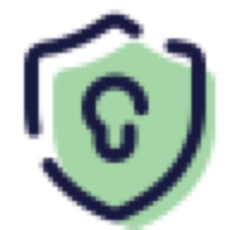

<p align="center">
  
</p>

<h1 align="center">Coco Dense</h1>

<p align="center">
  <strong>本地优先的跨平台密码管理器</strong><br/>
  AES-256-GCM 加密 · WebDAV 云同步 · 数据钥匙 · 生物识别
</p>

<p align="center">
  <a href="https://github.com/is-coco/coco-dense/releases"></a>
  
  
</p>

---

---

## 简介

Coco Dense 是一款**本地优先**的密码管理器，所有数据均以 AES-256-GCM 加密存储在本地。支持通过 WebDAV（坚果云等）进行多端同步，数据钥匙提供独立于主密码的第二层加密保护。

## 功能特性

### 核心安全
- **AES-256-GCM 加密** — 所有密码数据均以军事级加密标准保护
- **PBKDF2 250,000 轮密钥派生** — 抵御暴力破解
- **数据钥匙** — 独立于主密码的第二层加密，即使主密码泄露数据仍安全
- **安全问题找回** — 忘记主密码时可通过预设安全问题恢复
- **指纹/生物识别解锁** — 支持 Touch ID 等生物识别快速解锁
- **自动锁定** — 闲置超时自动锁定保险箱
- **剪贴板自动清除** — 复制密码后定时清除剪贴板
- **错误次数锁定** — 多次输错密码自动锁定

### 密码管理
- **条目管理** — 新增、编辑、删除密码条目
- **字段支持** — 名称、账号、密码、网址、备注
- **密码生成器** — 一键生成高强度随机密码
- **密码强度显示** — 实时显示密码强度等级
- **一键复制** — 点击字段即可复制到剪贴板
- **密码可见切换** — 显示/隐藏密码切换

### 组织与筛选
- **分组/文件夹** — 创建、重命名、删除分组，条目可拖拽移入移出
- **标签系统** — 为条目添加标签，支持按标签筛选
- **优先级** — 三级优先级（高/中/低），按优先级排序
- **收藏与置顶** — 常用条目置顶或收藏
- **全局搜索** — 按名称、账号、网址快速搜索

### 云同步
- **WebDAV 同步** — 支持坚果云等 WebDAV 服务
- **双向同步** — 上传本地数据、下载云端数据
- **同步状态指示** — 实时显示同步状态（绿/黄/红）
- **定时自动同步** — 每 5 分钟自动检查云端变化
- **增删改自动同步** — 数据变化后自动上传
- **同步配置持久化** — 配置保存在本地，重启不丢失

### 设置与备份
- **多标签设置页** — 云同步、数据钥匙、安全、备份、更新
- **修改主密码** — 随时更换主密码
- **数据钥匙管理** — 设置、生成、清除、本机记住
- **安全问题配置** — 设置找回问题和答案
- **导出加密文件** — 导出保险箱为加密 JSON 文件
- **版本更新** — 应用内检查 GitHub 最新版本并下载更新

### 用户体验
- **macOS 原生风格** — 遵循 Apple 设计规范，浅色系简约风格
- **明暗主题** — 跟随系统自动切换明暗模式
- **流畅动画** — 微交互动画，操作反馈及时
- **键盘快捷键** — Tab 切换字段、Enter 提交
- **上下文菜单** — 长按/右键弹出操作菜单

## 技术栈

### 桌面版（Electron）
- **Electron** — 跨平台桌面应用框架
- **HTML/CSS/JavaScript** — 前端界面
- **Node.js** — 后端逻辑、加密、文件操作
- **safeStorage** — 系统级安全存储（已签名版本）

### 移动版（Flutter）
- **Flutter** — 跨平台 UI 框架
- **Dart** — 编程语言
- **encrypt + pointycastle** — AES-256-GCM 加密
- **http** — WebDAV 网络请求
- **path_provider** — 本地文件存储
- **local_auth** — 生物识别认证

### 加密架构
```
主密码 → PBKDF2(250000轮) → 解锁验证
数据钥匙 → PBKDF2(250000轮) → 解密 vaultKey
vaultKey → AES-256-GCM → 解密每条密码数据
```

- **V2 格式** — 主密码直接加密 vaultKey
- **V3 格式** — 数据钥匙加密 vaultKey，主密码仅用于验证身份
- 每条密码数据独立加密，单独泄露无法解密

## 安装

### macOS
1. 从 [Releases](https://github.com/is-coco/coco-dense/releases) 下载 `Coco.Dense-x.x.x-arm64.dmg`
2. 双击 DMG，将应用拖入 Applications 文件夹
3. 如果提示"已损坏"，在终端执行：
   ```bash
   sudo xattr -cr /Applications/Coco\ Dense.app
   ```

### Windows
1. 从 [Releases](https://github.com/is-coco/coco-dense/releases) 下载 `Coco.Dense-x.x.x-Setup.exe`
2. 双击运行安装程序

### Android
1. 从 [Releases](https://github.com/is-coco/coco-dense/releases) 下载 `coco-dense-x.x.x-android.apk`
2. 在手机上打开 APK 文件安装（需允许未知来源安装）

## 使用指南

### 首次使用
1. 打开应用，设置主密码
2. 点击"创建保险箱"
3. 开始添加密码条目

### 云同步设置
1. 进入 **设置 → 云同步**
2. 填写 WebDAV 服务器信息（以坚果云为例）：
   - 服务器：`https://dav.jianguoyun.com/dav/`
   - 用户名：坚果云注册邮箱
   - 应用密码：在坚果云后台"安全选项 → 第三方应用管理"生成
3. 点击"保存"后"测试连接"
4. 点击顶部同步按钮进行数据同步

### 数据钥匙
1. 进入 **设置 → 数据钥匙**
2. 输入数据钥匙密码（或点击"随机生成"）
3. 勾选"本机记住"可免输入
4. 点击"保存"

### 多端同步
1. 在每台设备上安装对应版本
2. 使用相同主密码创建保险箱
3. 配置相同的 WebDAV 同步信息
4. 点击同步按钮，数据自动合并

## 项目结构

```
coco-dense/
├── lib/                          # Flutter 源码
│   ├── main.dart                 # 入口、主题配置
│   ├── crypto/
│   │   └── vault_crypto.dart     # AES-256-GCM 加密模块
│   ├── models/
│   │   └── vault_entry.dart      # 数据模型
│   ├── screens/
│   │   ├── auth_screen.dart      # 登录页
│   │   ├── vault_screen.dart     # 主页面（列表+分组）
│   │   ├── entry_detail_screen.dart # 条目详情
│   │   └── settings_screen.dart  # 设置页（多标签）
│   └── services/
│       ├── vault_service.dart    # 数据存储服务
│       ├── sync_service.dart     # WebDAV 同步服务
│       └── update_service.dart   # 版本更新服务
├── src/                          # Electron 源码
│   ├── main/
│   │   ├── crypto.js             # 加密模块
│   │   ├── sync.js               # 同步模块
│   │   ├── datakey.js            # 数据钥匙模块
│   │   ├── recovery.js           # 安全问题模块
│   │   ├── biometric.js          # 生物识别模块
│   │   └── updater.js            # 更新模块
│   └── renderer/
│       └── utils.js              # 渲染工具
├── script.js                     # Electron 前端逻辑
├── styles.css                    # Electron 样式
├── index.html                    # Electron 界面结构
├── main.js                       # Electron 主进程
├── macos/                        # Flutter macOS 配置
├── android/                      # Flutter Android 配置
└── pubspec.yaml                  # Flutter 依赖配置
```

## 开发

### 环境要求
- **Flutter** >= 3.12
- **Dart** >= 3.12
- **Node.js** >= 18（Electron 版本）
- **Xcode**（macOS 构建）
- **Android Studio**（Android 构建）

### 运行
```bash
# Flutter macOS 版
flutter run -d macos

# Flutter Android 版
flutter run -d android

# Electron 版
npm install
npm start
```

### 构建
```bash
# Flutter macOS
flutter build macos --release

# Flutter Android APK
flutter build apk --release

# Electron macOS
npx electron-builder --mac --arm64

# Electron Windows
npx electron-builder --win --x64
```

## 更新日志

### v0.4.9
- 修复同步配置持久化问题
- 修复数据钥匙自动加载
- 修复下载云端数据后刷新列表
- 应用图标与桌面版统一
- 分组拖拽移动条目

### v0.4.8
- 新增自动同步、同步状态指示
- 新增指纹解锁
- 新增闲置自动锁定
- 新增剪贴板自动清除
- 新增定时同步检查

### v0.4.7
- Flutter 全平台版本（macOS/Android）
- 数据钥匙独立加密
- 分组/文件夹管理
- 标签系统、优先级、收藏/置顶
- 密码生成器
- WebDAV 云同步
- 安全问题找回
- GitHub 版本更新检查

## 安全说明

- 所有密码数据均在本地以 AES-256-GCM 加密存储
- 主密码和数据钥匙永远不会发送到服务器
- WebDAV 同步仅传输加密后的数据
- 建议使用强密码作为主密码
- 建议启用数据钥匙提供额外保护层
- 建议定期备份保险箱文件

## 许可证

Copyright © 2026 Coco Dense. All rights reserved.
